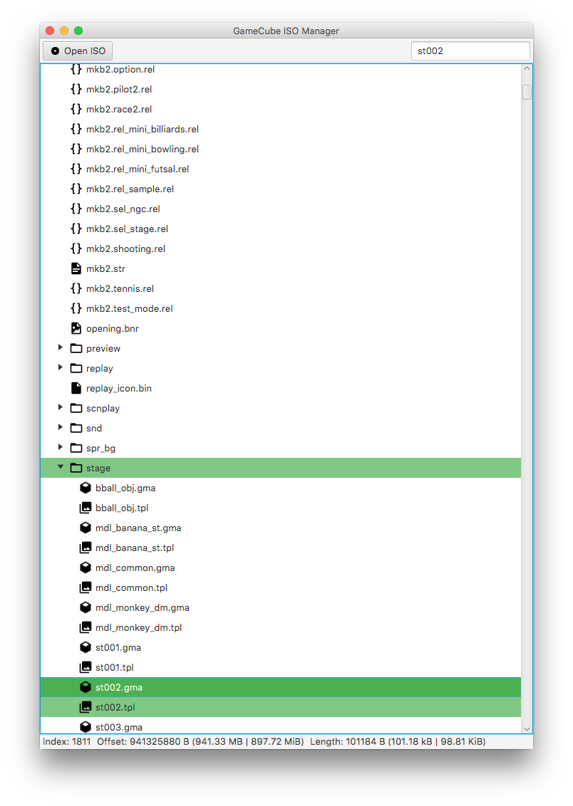

GC ISO Manager
==============



## Creating a JAR file from source

Note that JDK 8 or higher is required.  

If you have Gradle installed:
```shell
gradle jar
```

If you don't have Gradle installed:
```
./gradlew jar
```